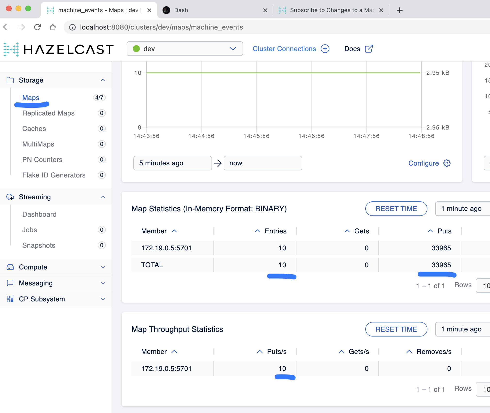
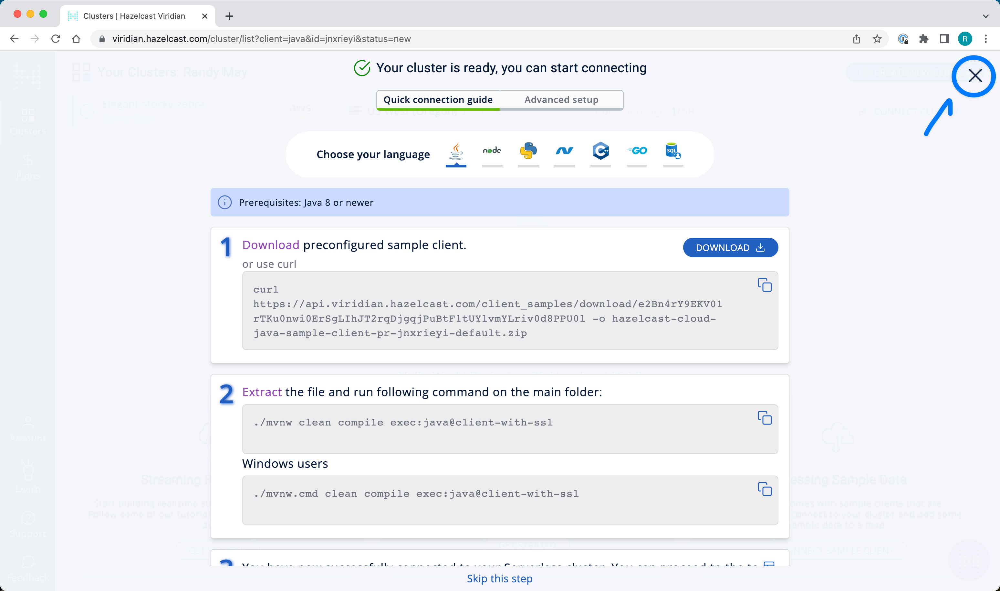

# Lab Briefing

> **Note** This lab guide uses Markdown formatting.  The best way to view it is directly on the GitHub site 
> https://github.com/hazelcast-guides/stream-processing-fundamentals or your own fork.

We will be building a Hazelcast Pipeline for monitoring and reacting to telemetry from a machine shop.

ACME operates 1000’s of machines.  Each publishes several data points each second. Measurements include things like 
bit temperature and RPM. Breakage is expensive. We want to go beyond maintenance schedules and monitor the information 
in real time. Each machine has its own parameters for acceptable bit temperature, which are stored in a 
*machine_profiles* IMap.  If excessive bit temperatures are caught in time, breakage can be averted by immediately 
reducing the cutting speed.  Our Pipeline will do this by sending "green" / "orange" / "red" signals to the machines 
via the *machine_controls* IMap.  A schematic of the lab is shown below.


# Step 1: Validate the Lab Environment

> **TO DO**
> 
> Run the following commands to start your lab environment.
```shell
mvn install
docker compose up -d
docker compose ps
```

You should see  5 services up and running.  You may also see a 6th service called *refdata_loader* which exits after 
it has loaded data into the *machine_profiles* map. 

Each service is described briefly below.

| Service         | Description                                                                                                                              |
|-----------------|------------------------------------------------------------------------------------------------------------------------------------------|
| hz              | A Hazelcast node                                                                                                                         |
| mc              | The Hazelcast Management Center. Accessible at http://localhost:8080.                                                                    |
| event_generator | Emulates traffic from a set of machines. Writes to *machine_events*. Listens to *machine_controls*                                       |
| cli             | Runs the Hazelcast CLI.  Used for deploying jobs.                                                                                        |
| ui              | A Python program that listens to the *machine_events* map and displays temperature data graphically. Accessible at http://localhost:8050 |


> **TO DO** 
> 
> Access the UI at http://localhost:8050. Specify a Location and Block to see a live display of the current 
> temperature of a subset of machines.  Valid locations are "San Antonio" and "Los Angeles". Valid blocks are "A" and 
> "B". *Note: machines in block "A" are very likely to run hot.*  You should see something similar to the image below.


# Step 2: Get to Know the Data

Data in Hazelcast clusters can be accessed via SQL.  For more details, see https://docs.hazelcast.com/hazelcast/latest/sql/get-started-sql

> **TO DO**
> 
> Open up the management center (http://localhost:8080) and click on the "SQL Browser" button.


## Machine Profiles
> **TO DO** 
> 
> Run `select * from machine_profiles` in the SQL Browser.

You will see that for each machine there is a serial number, information about the location and the warning and 
critical temperature limits for that particular machine.


## Machine Events

> **TO DO**
> 
> Run `select * from machine_events`


This is the actual data coming from the machines.  

> **Note**:  At any given time, only the latest event for each serial number 
appears in the map, however, the update events are all recorded into something called a _map journal_ that can be 
used as input to a Pipeline.  You can verify that the map is constantly being updated by navigating to the 
_machine\_events_ map in Management Center and observing the number of put operations.



# Step 3: Learn About Data Formats

## GenericRecord

It is a best practice to avoid using POJOs in Pipelines if that POJO will be stored in a Hazelcast map.  It can cause 
class loading problems.  

> **Note**: When using _Compact_ or _Portable_ serialization, Hazelcast automatically translates POJOs 
into _GenericRecord_ when accessed on the server side. 

In this lab, you will be working with _MachineProfile_ objects and _MachineEvents_, both of which are defined in 
 `common/src/main/java`.  However, those classes are not deployed with your job.  Intead , you will need to access 
them using GenericRecord.  An example of GenericRecord usage is shown below.

```java
GenericRecord machineEvent;
short bitTemperature = machineEvent.getInt16("bitTemp");
```
For more information on GenericRecord and accessing domain objects without domain classes see
https://docs.hazelcast.com/hazelcast/5.2/clusters/accessing-domain-objects.

## Tuples
As data proceeds through your pipeline its shape changes.  For example, you may look up the warning 
and critical temperatures for a particular machine and send them along with the original event to the next stage
in the pipeline.  There is no need to create special container classes for situations like this, you can use Tuples 
instead.  Here is an example.

```java
// create a 3-tuple that consists of the serial number and bit temperature from the event 
// and the warning temperature from the machine profile

GenericRecord p;
GenericRecord e;

Tuple3<String,Short,Short> newEvent = 
        Tuple3.tuple3(e.getString("serialNum"), e.getShort("bitTemp"), p.getShort("warningTemp"));

// now, if we want to access fields from the 3-tuple, we use f0(), f1() and f2()
short bitTemp = newEvent.f1();
```

# Step 4: Deploy Your First Job

> **TO DO**
> 
> In your IDE, navigate to the *pipelines* project.  Open up  the 
> *hazelcast.platform.labs.machineshop.TemperatureMonitorPipeline* class and review the code there.  

The main method, shown below, is boilerplate that helps with deploying the job to a cluster.
You do not need to change this.
```java
    public static void main(String []args){
        Pipeline pipeline = createPipeline();
        pipeline.setPreserveOrder(true);

        JobConfig jobConfig = new JobConfig();
        jobConfig.setName("Temperature Monitor");
        HazelcastInstance hz = Hazelcast.bootstrappedInstance();
        hz.getJet().newJob(pipeline, jobConfig);
    }
```

You will do all of your work in the *createPipeline* method of this job. It always starts with creating a *Pipeline* 
object.  You then build up the Pipeline by adding stages to it.

```java
   public static Pipeline createPipeline(){
        Pipeline pipeline = Pipeline.create();
        // add your stages here
        return pipeline;
   }
```

> **NOTE** 
> - We use the shade plugin to bundle all project dependencies , *other than Hazelcast*, into a single jar. The 
> Hazelcast classes should not be included because they are already on the server.
> - Code with *com.hazelcast* package names cannot be deployed to a *Viridian* cluster.

Currently, the *createPipeline* method contains only a source (reading from the *machine_events* map) and a sink, 
which simply logs the events to the console.  This can be useful during debugging. In the next step, you'll make a 
small change to the Pipeline and walk through a typical code/test cycle.


> **TO DO**
> 
> Make a small change to the output format in the *writeTo* statement just so we can walk through building and 
> deploying a pipeline.  After you've made the change, you can deploy the pipeline using the commands below.
> ```shell
> cd pipelines
> mvn package
> cd ..
> docker compose run submit_job
> # look for the logging statements in the Hazelcast logs
> docker compose logs --follow hz
> Ctrl-C
> ```

You should see something like this:
```shell
stream-processing-fundamentals-hz-1  | 2023-02-01 21:11:44,357 [ INFO] [hz.hungry_lehmann.jet.blocking.thread-0] [c.h.j.i.c.WriteLoggerP]: [172.19.0.5]:5701 [dev] [5.2.1] [temp_monitor_161114/loggerSink#0] New Event SN=HYV569
stream-processing-fundamentals-hz-1  | 2023-02-01 21:11:44,370 [ INFO] [hz.hungry_lehmann.jet.blocking.thread-0] [c.h.j.i.c.WriteLoggerP]: [172.19.0.5]:5701 [dev] [5.2.1] [temp_monitor_161114/loggerSink#0] New Event SN=FXQ058
stream-processing-fundamentals-hz-1  | 2023-02-01 21:11:44,591 [ INFO] [hz.hungry_lehmann.jet.blocking.thread-0] [c.h.j.i.c.WriteLoggerP]: [172.19.0.5]:5701 [dev] [5.2.1] [temp_monitor_161114/loggerSink#0] New Event SN=RUO239
stream-processing-fundamentals-hz-1  | 2023-02-01 21:11:44,640 [ INFO] [hz.hungry_lehmann.jet.blocking.thread-0] [c.h.j.i.c.WriteLoggerP]: [172.19.0.5]:5701 [dev] [5.2.1] [temp_monitor_161114/loggerSink#0] New Event SN=DYQ714
```

> **TO DO**
> 
> Inspect the running job using the management center and, **when you are done, cancel it**.  The Hazelcast cluster will 
remain up and events will continue to flow. 


# Step 5: Pat Yourself on the Back 
_You've deployed your first pipeline_

# Step 6: Finish the Pipeline

Continue building the pipeline following the instructions in `TemperatureMonitorPipeline.java`
You may want to deploy and cancel the job multiple times while you are building the pipeline. When you are done, 
look at the UI.  You should be able to tell that your job is now controlling the machines.


You can also see machine control events in the "event_generator" log.
```shell
docker compose logs --follow event_generator
```

> **NOTE**
> If at any point you git stuck, you can refer to the solution which you will find in the
> *hazelcast.platform.labs.machineshop.solutions* package.

# Step 7: Deploy  to Viridian

In this step, you will deploy your temperature monitoring Pipeline to a Viridian cluster 
and connect the UI, refdata loader and event_generator to it as well.

> **TO DO** 
> 
> If you haven't already done so, navigate to https://viridian.hazelcast.com, create an 
> account, and create a new "Production" cluster.  This will deploy a 3 node cluster.  After the cluster is deployed, 
> close the "Quick Connection Guide" as shown below.



You will need to enable event journals on the "machine_events" map before deploying the Pipeline. The 
"refdata_loader" service will automatically do the required setup but it requires that certain classes be available 
on the server classpath.  

> **TO DO**
> 
> In the Viridian console, select the cluster you will use and navigate to 
> "Manage/Custom Classes".  Upload "common/target/common-1.0-SNAPSHOT.jar".


> **NOTE** This step is required because we are using the the Java Executor Service 
> (https://docs.hazelcast.com/hazelcast/5.2/computing/executor-service#hide-nav) to perform 
> dynamic configuration of the "machine_events" region in Viridian. With Pipeline deployments,
> tranferring the classes to the cluster is handled automatically during deployment.  You do not need 
> to manually upload the Pipeline.  

Next we will obtain all of the keys and configuration parameters required to make a connection to Viridian.

> **TO DO**
> 
> In the Viridian Console, click on "Connect Cluster" next to your cluster, then select "Advanced Setup" and 
> Download the keystore file for your cluster as shown below.  Unzip the downloaded file and place it directly 
> inside of the "stream-processing-fundamentals" directory.  You will also need the discovery 
> token, truststore password and cluster id that are displayed on that screen. 


> **TO DO**
> 
> Now edit "viridian.env" and provide the path to the key files, the discover token, the 
> cluster id and the keystore password.
> 
> Once you have done this, you are ready to start the refdata_loader, event_generator and ui pointed to your 
> Viridian cluster: `docker compose -f viridian.compose.yaml up -d`.  You can view the logs with 
> `docker compose -f viridian.compose.yaml logs --follow`.  Also, use the Management Center for your cluster to verify 
> that it is receiving traffic.  
> 
> Lastly, submit your job: `docker compose -f viridian.compose.yaml run submit_job`. You can verify it is running using
> Management Center accessible from the Viridian console.

# The End
### Congratulations!
If you made it this far then you know the fundamentals of real-time stream processing with Hazelcast!

> **NOTE** This project contains many useful helpers.  Please feel free to study it and use it as a template for your 
> own projects.


